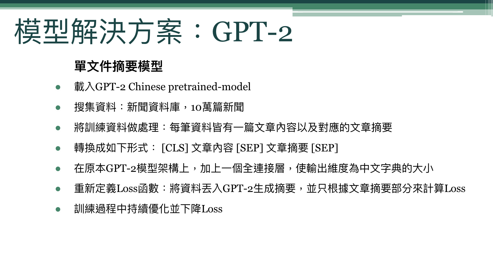
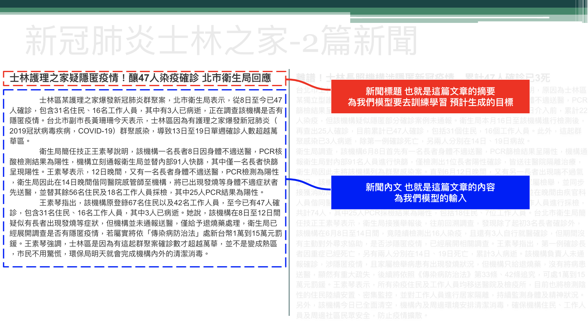
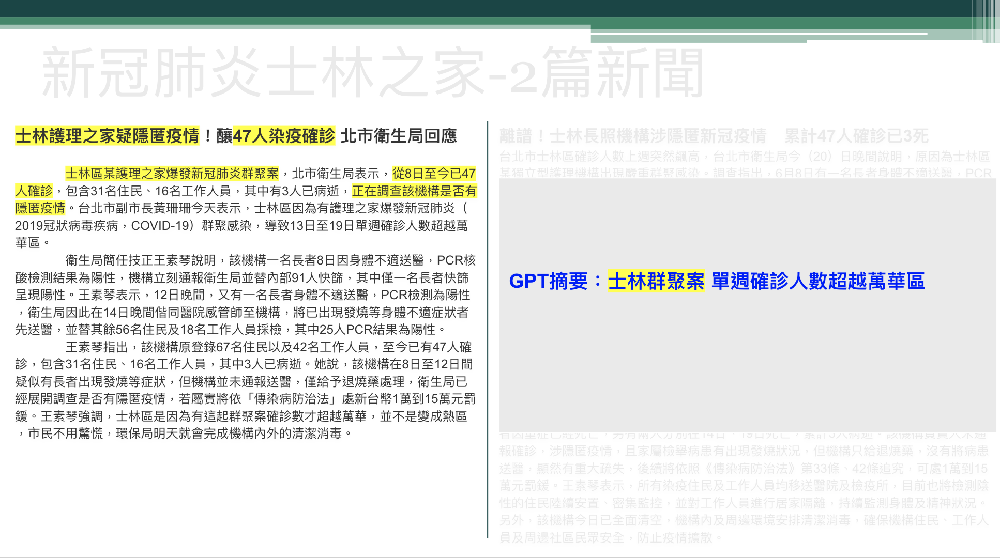

# GPT2

Use GPT2 model to do abstraction-based summarization on traditional Chinese articles/news.

Application: automatically generate summary or news title based on input content. 

-------------
## File Outline and Explanation

### Folder 

-config : GPT2 model's config if use initial GPT2 model. If use pretrained model then this config will not effect the model.

-data_dir : the directory of dataset

    --news : news dataset folder

    --prepare_newsdata.ipynb : tranforms the csv into two text file, train_label.txt and train_text.txt

    --train_text.txt : news content
    
    --train_label.txt : news title

    --train_data.json : training data for training

    --test_data.json : testing data for evaluating
    
    --cached_test_1020/cached_train_1020 : cached file for pytorch

-output_dir_pre : location of output model 

-pretrain_model : location of pretrained model (GPT2 Chinese base)

-runs : history event file of training

-vocab : vocabulary of Chinese words

--------
### Code File

-data_help.py : Do the data preprocessing, data cleaning, generating the training and testing data. 
Input are train_text.txt and train_label.txt. Output are train_data.json and test_data.json.

-data_set.py : Define the data format according to model

-model.py : GPT2 model file, which is adjusted from transformers GPT2LMHEADModel. We adjust the calculation of loss, and we only count the loss of title part.

-train.py : GPT2 model training file.

-generate_title.py : According to trained model, use it to generate the title based on the article content.

-main.py :  FastAPI Demo. Port is 7000.

------
### Application example

